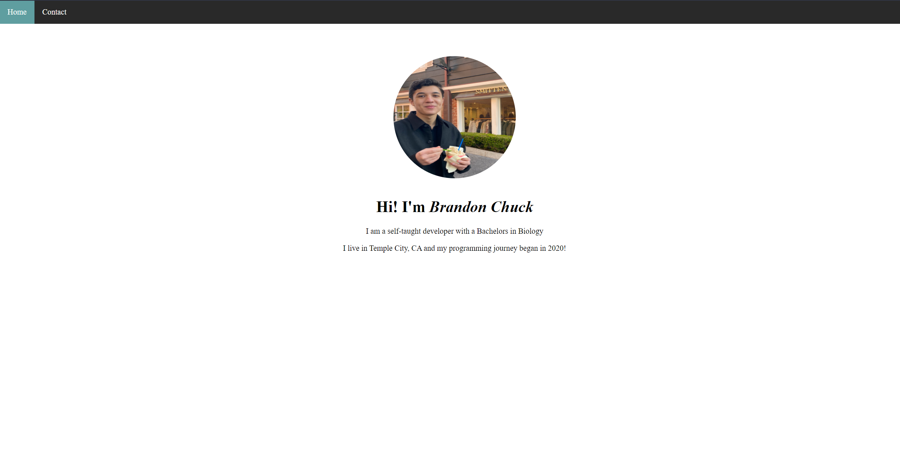

# Simple HTML/CSS Personal Website

# Overview
- Simple personal website built using purely HTML and CSS.
- Website contains a home page with a profile picture as well as a contact page with contact information.

# Website
- Here's a link to the website hosted via Github Pages! https://brandonchuck.github.io/Project-1-PersonalWebsite/

# Preview

# Summary
First HTML & CSS project to learn the basics of web development. This project helped me practice creating simple nav bars with the ul > li technique. I also gained some experience with tweaking CSS classes and id's to add a personal touch to the website! In addition, functionality was created by having 2 separate pages linked together via <a> anchor tags. My greatest challenge with this project was adjusting the CSS properties to properly organize the li elements within the navbar. We all know CSS can be very frustrating, but it is rewarding to see the finished product in the end!  

# Author
Brandon Chuck | Full Stack Developer | [LinkedIn](https://www.linkedin.com/in/brandonchuck/)
